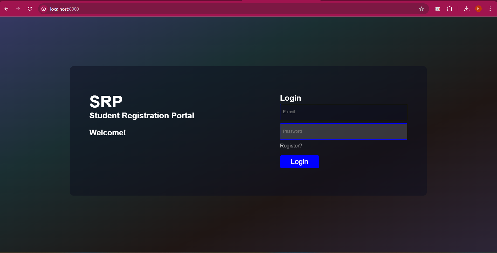

# Student Registration Portal (SRP)

📌 Overview

The Student Registration Portal (SRP) is a web-based platform built using Spring Boot and MySQL, designed to streamline student registration, club enrollments, event updates, and team hierarchy management.

🚀 Features

📝 Student Registration: Sign up and manage student profiles.

🏫 Club Management: View available clubs and join them.

📅 Event Updates: Stay informed about upcoming events.

🏆 Achievements: Track club and individual achievements.

🏛 Team Hierarchy: View the organizational structure of clubs.

🛠 Tech Stack

Frontend

HTML, CSS, JavaScript

Bootstrap (for responsive UI)

Backend

Spring Boot (Java-based framework)

Spring Security (for authentication)

Spring Data JPA (for database operations)

Database

MySQL (Database management system)

🔧 Installation & Setup

Clone the repository

git clone https://github.com/krish2677/Student-Registration-Portal-SRP-.git
cd Student-Registration-Portal-SRP-

Configure the database (Update src/main/resources/application.properties)

spring.datasource.url=jdbc:mysql://localhost:3306/srp
spring.datasource.username=root
spring.datasource.password=root

Run the Spring Boot application

mvn spring-boot:run

📷 Screenshots

📌 Contributing

Feel free to contribute by opening issues and pull requests.

📜 License

This project is open-source and available under the MIT License.

✨ Developed by Krish & Team 
